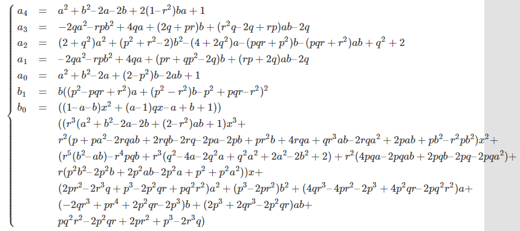

# pnp
A collection of tools for solving the Perspective-n-Point (PnP) problem in compute vision.

### compile and run
```bash
# get into folder
cd source_folder
# generate empty folder to store compilation file
mkdir -p build
# compile configuration
cmake ..
# compile
make
# run
./epnp
```

### BA
Bundle Adjustment. A non-linear solution.

### p3p
Calculate pose of camera by 3 pairs of 2D pixel and 3D coordinate.
##### 借鉴
1. [source code](https://blog.csdn.net/leonardohaig/article/details/120756834)
2. [reference](https://www.cnblogs.com/mafuqiang/p/8302663.html)

##### 流程
1. 根据3D坐标和相似三角形计算点的深度
2. 根据点的深度求出对应的2D点在当前相机坐标系下的3D坐标
3. 根据世界坐标系下的3D坐标和当前相机坐标系下的3D坐标求解相机位姿

##### 参考
1. 关于雅可比算法计算特征值和特征向量的部分，[参考说明](https://blue-stone.top/blog/eigen/)
2. 吴消元法的计算，


### epnp
source code: opencv

##### reference
[Detailed note](https://www.jianshu.com/p/b3e9fb2ad0dc)

##### paper
<EPnP: An Accurate O(n) Solution to the PnP Problem> 2009

You can find it [here](todo).
### PnPRANAAC

