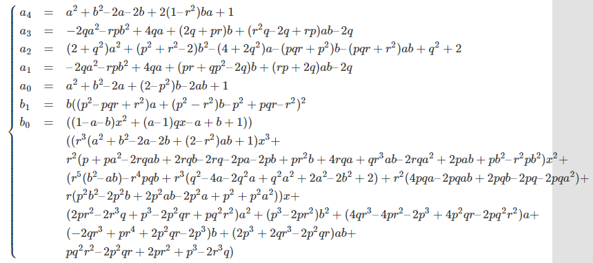

### 借鉴
1. [source code](https://blog.csdn.net/leonardohaig/article/details/120756834)
2. [reference](https://www.cnblogs.com/mafuqiang/p/8302663.html)

### 流程
1. 根据3D坐标和相似三角形计算点的深度
2. 根据点的深度求出对应的2D点在当前相机坐标系下的3D坐标
3. 根据世界坐标系下的3D坐标和当前相机坐标系下的3D坐标求解相机位姿

### 参考
1. 关于雅可比算法计算特征值和特征向量的部分，[参考说明](https://blue-stone-w.top/blog/eigen/)
2. 吴消元法的计算，
